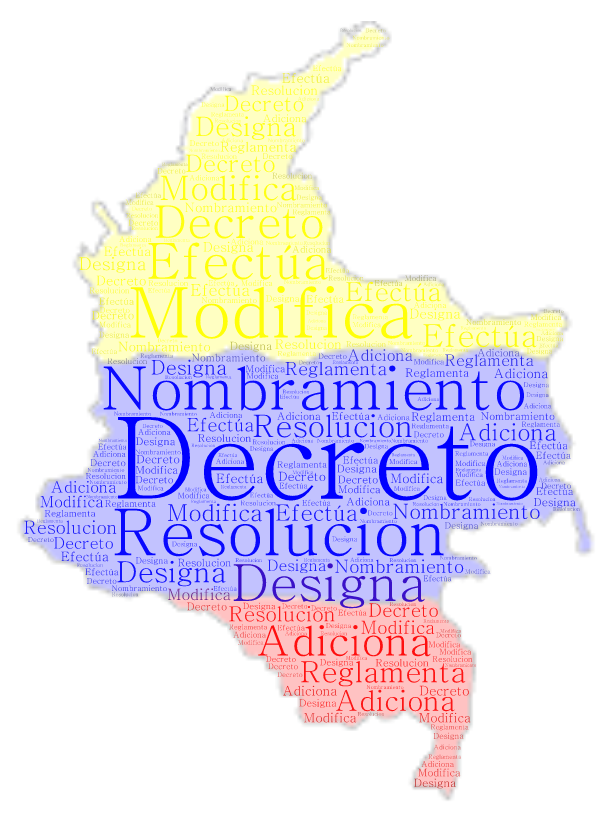
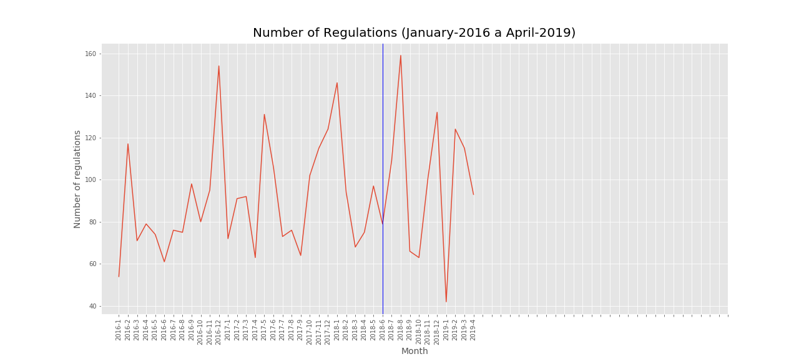
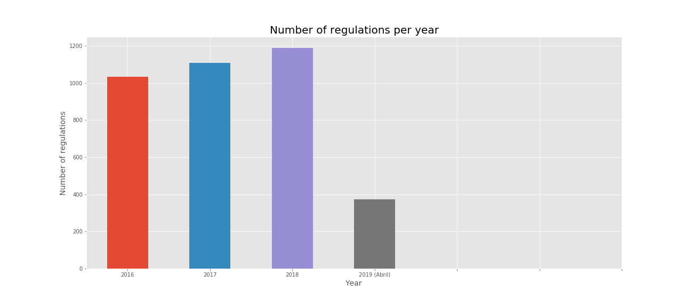
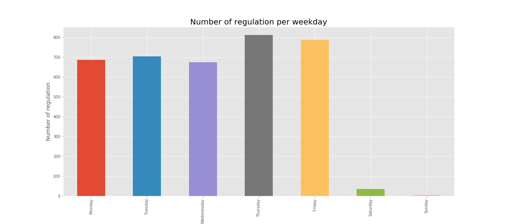
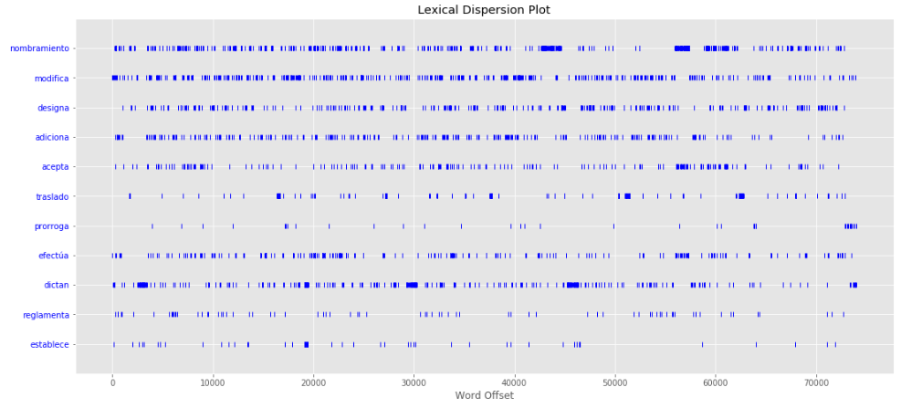

# Readme File of Final Project 
24-05-2019

# Analysis of Regulation in Colombia, January 2016 - April 2019

*Wordcloud created using [WordArt](https://wordart.com/)
---

## Description of Project

Regulation is one of the key factors for economic growth and development in a Country, and it as important as monetary and fiscal policy according to the [OECD](https://www.oecd.org/publications/oecd-regulatory-policy-outlook-2015-9789264238770-en.htm). 
Since Colombia is now part of the OECD the application of international standards is necessary, therefore, the "Grupo de Política de Mejora Regulatoria" (MR) from the National Department of Planning ([DNP](https://www.dnp.gov.co/programas/Mejora%20Regulatoria/Paginas/Mejora-Regulatoria.aspx)) has the goal of providing support to the public regulators to improve the quality and reduce the quantity of ongoing and new regulation.

For my analysis, I will consider the available regulation from the presidency [Webpage](https://dapre.presidencia.gov.co/normativa). 
Web Scraping of [Presidential web page](https://dapre.presidencia.gov.co/normativa) to obtain national regulation (e,g. Decretos, Resoluciones) from January of 2016 to April of 2019.

From this information I would like to answer the following questions:
    - Has the number of regulation increased or decreased? I would like to graph this behavior and check the dates with the highest number of regulations. Also, I want to compare the number of regulation to the political cycle, particularly to the presidential elections(May of 2018).
    - Has there been any change since the implementation of the MR on the number of regulations? Clearly this policy takes time to have an impact since public officers need to be trained and taught; however, I want to check if there is a short term difference.
    - How much of the regulation is "relevant"? Since Decretos and Resoluciones are used for regulations, but also to appoint a new politician and accept resignations, I want to focus on the "relevant" ones. By relevant I mean that it actually has an impact on the economy through new policies or modifications of existing regulation. 

### Using Python (Jupyter Notebook)
The presidetial web page organizes the Decretos by each month of the year and in a different link all the Resoluciones. 
I have a total of 41 periods to analyze, which gives me a total of 3706 regulations.

For this purpose I used:
1. Scraping
    - BeautfulSoup and Regex for Web Scraping through the different links 
    - Python Code is available ([1-Scrpaing](https://github.com/FranPacho/MCPP_francisco.monsalve/blob/master/Final/I-%20Web%20Scraping%20(Links%20presidencia).ipynb))
2. Pandas
    - I used Pandas library to build a DataFrame with the links, title, and date
    - Python Code is available ([2-Pandas](https://github.com/FranPacho/MCPP_francisco.monsalve/blob/master/Final/II.%20Regex%20y%20Pandas%20-%20An%C3%A1lisis%20Decretos.ipynb))
    - Again with Pandas, I analyze the descriptions I could obtain from 1,  to analyze relevant regulation ([3-Pandas](https://github.com/FranPacho/MCPP_francisco.monsalve/blob/master/Final/III.%20Pandas%20-%20An%C3%A1lisis%20del%20dataframe.ipynb))
    - With the final information, I use NLTK for lexical dispersion and frequency of words ([4-Nltk](https://github.com/FranPacho/MCPP_francisco.monsalve/blob/master/Final/IV%20-%20NLTK%20on%20Dataframe.ipynb))

### Main Findings

Total of 3706 regulations
3645 Decretos
61 Resoluciones
Using key words to determine relevance of regulation, only around 35% of regulation is "relevant"

Cyclical behavior. Line represents presidential elections

--- 

